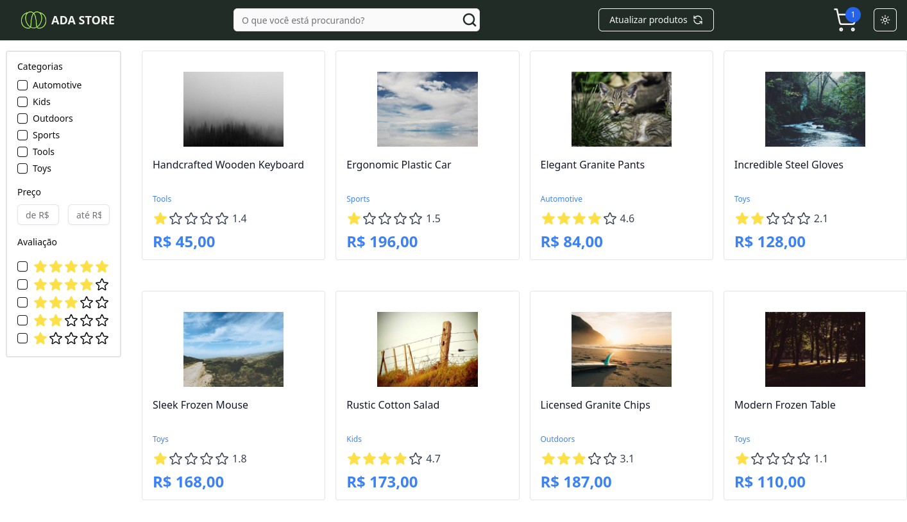

# ADA STORE


> Esta é uma aplicação desenvolvida para o bootcamp da Cielo, com intuito de comprovar conhecimentos em frontend.

<div style="width:100%; display:flex; align-items:center; gap:16px">
    
</div>

## Detalhes do aplicativo

- O projeto consiste em uma loja de produtos, na qual o usuário pode selecionar produtos, alterar quantidade, adicionar 
ao carrinho e fazer diversos filtros por categorias, por nome do produto e etc.

## 🚀 Melhorias futuras
- [ ] - Inserir testes automátizados
- [ ] - Criar um fluxo de tratamento de erros
- [ ] - Inserir responsividade

## Tecnologias utilizadas

- Tailwindcss (Ferramenta para produtividade na estilização)
- Shadcn/UI (Lib de components para melhorar a produtividade)
- React
- Lucide Icons (Biblioteca para ícones)

## Protótipo do projeto
- ### Figma (https://www.figma.com/file/dCrgggOntU3hNdsaT4ZrHc/ADASTORE?type=design&node-id=202-3&mode=design)


## 💻 Como usar o projeto
Para utilizar e testar o projeto, esteja em um computador com Node Js instalado e siga as
etapas abaixo:

1 clone o projeto com o comando
```
git clone https://github.com/GRUPO3-CIELO-BOOTCAMP/ada-store.git
```
2 Acesse o projeto pelo terminal com o comando
```
cd ada-store
```
3 Instale as dependências necessárias com o comando
```
npm install
```
4 Crie um arquivo .env
```
VITE_API_BASE_URL=http://localhost:3000
VITE_API_TIMEOUT=20000
VITE_DEFAULT_PAGE_SIZE=10
VITE_DEFAULT_PAGE_NUMBER=1
```
5 Rode o projeto com o comando
```
npm run dev
```
6 Acesse o projeto
```
http://localhost:3333
```

## 🌐 Links úteis
[NodeJS](https://nodejs.org/en/download)
[Tailwind](https://tailwindcss.com/)
[ShadcnUI](https://ui.shadcn.com/)
[LucideIcons](https://lucide.dev/)


## 🧑‍💻 Igor Alves Rodrigues

[](https://www.linkedin.com/in/igor-alves-rodrigues-7941a116b/)
[](https://gthub.com/igoralvesr)
[](http://wa.me/5548998434969)
[](https://igoralvesr.github.io)


